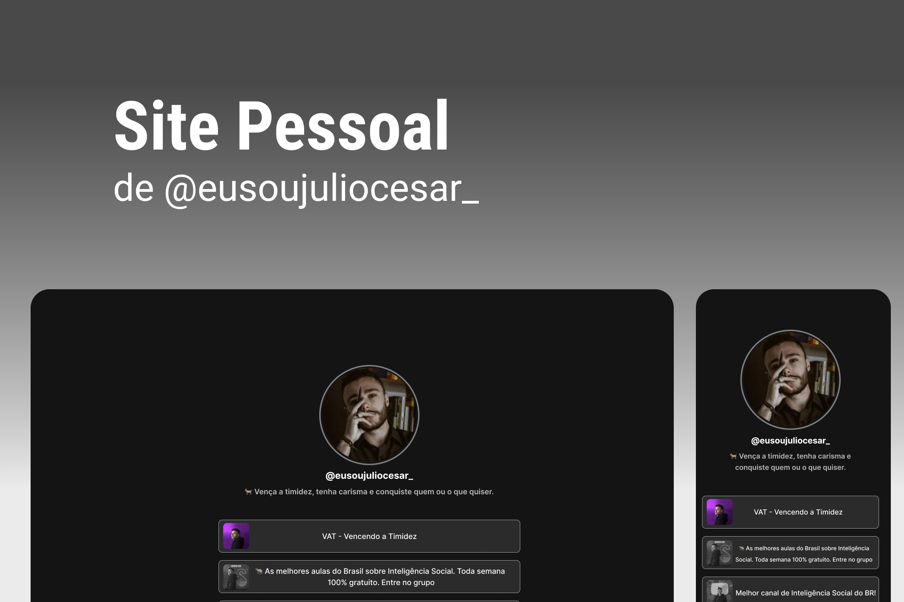

<h1 align="center"> Site Pessoal do Júlio </h1>

Esse site foi criado com foco em replicar e substituir o site pessoal já utilizado pelo Júlio, trazendo autonomia e melhorando a qualidade do UI Design.  

  <a href="#-tecnologias">Tecnologias</a>&nbsp;&nbsp;&nbsp;|&nbsp;&nbsp;&nbsp;
  <a href="#-projeto">Projeto</a>&nbsp;&nbsp;&nbsp;

 

  

 

## 🚀Tecnologias

Esse projeto foi desenvolvido com as seguintes tecnologias:

- HTML e CSS
- Git e Github
- Figma

 

## 💻 Projeto

O site do júlio é de uso pessoal. Tem interesse em comunicação? Dá uma olhada lá.

- [Visite o projeto online](https://luad3cristal.github.io/juliocesar)

